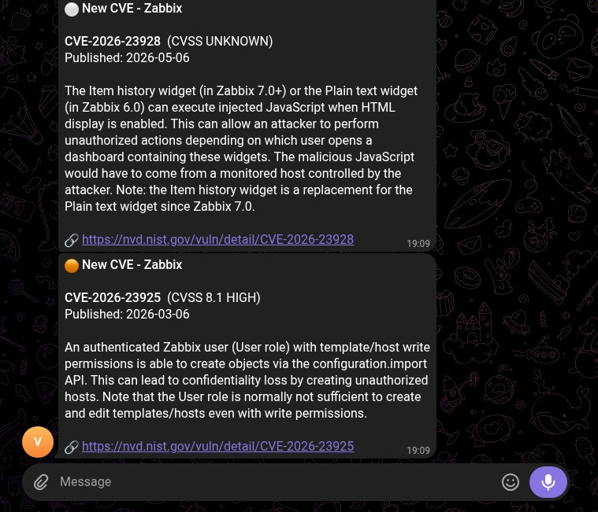

# CVEAlertor

**Get an instant Telegram alert the moment a new CVE is published for software you actually run.**

You tell CVEAlertor which products are in your stack (Zabbix, Roundcube, VMware
ESXi, …). On the first run it pulls **every existing CVE** for each product into a
per-service baseline file. On every run after that it re-fetches, **diffs against
the baseline**, and fires a **Telegram alert** for each genuinely new CVE — then
updates the baseline so you're never alerted twice.

No dashboards to watch, no mailing lists to skim. Just the CVEs that matter to
*your* infrastructure, pushed to your phone.

<p align="center">
  
</p>

---

## Features

- 📡 **Per-product monitoring** — track exactly the software you run
- 🔔 **Instant Telegram alerts** — severity, CVSS score, publish date, NVD link
- 💥 **Public PoC watching** — alerts when a proof-of-concept / exploit repo appears on GitHub for a CVE you track (the signal that bumps a vuln to the top of your patch queue)
- 🧠 **Smart baseline diff** — first run is silent; only *new* CVEs (and *new* PoCs) alert afterwards
- 🎯 **Severity threshold** — optionally alert only on High/Critical (`min_cvss`)
- ⏱️ **Your schedule** — check every `30m`, `1h`, `6h`, `1d`… your choice
- 🛠️ **One-command setup wizard** — type product names, done
- 🔁 **Runs as a service** — systemd (Linux) / Task Scheduler (Windows), survives reboots, auto-restarts
- 🔄 **Reliable delivery** — failed alerts retry next cycle instead of being lost
- 🐍 **Zero dependencies** — pure Python 3 standard library

---

## Quick start

```bash
python cvealertor.py --setup
```

That single command walks you through everything:

```
service> zabbix
  + Zabbix  (search: 'zabbix')
service> roundcube
  + Roundcube  (search: 'roundcube')
service> esxi
  + VMware ESXi  (search: 'esxi')
service>                       ← blank line = done

How often should CVEAlertor check for new CVEs?
interval> [1h] 1h

Also watch GitHub for public PoCs / exploits for your CVEs?
enable PoC monitoring? [Y/n] y

How often should it check for new PoCs?
poc interval> [1d] 1d

Now your Telegram details:
bot token> 1234567890:AAExample_Token_String_Here
chat id>   -1002468013579

How should CVEAlertor run?
  [1] Install as a service - runs now + on every boot, auto-restarts  (recommended)
  [2] Watch in this terminal now
  [3] Nothing - I'll start it later
choice> [1]
```

Pick **[1]** and you're done — it baselines silently, then monitors forever.

---

## Getting your Telegram bot token & chat ID

**1. Bot token** — in Telegram, message **@BotFather** → `/newbot` → follow the
prompts. It gives you a token like `1234567890:AAExample_Token_String_Here`.

**2. Chat ID** — message your new bot (or add it to a group), then open:
```
https://api.telegram.org/bot<YOUR_TOKEN>/getUpdates
```
Find `"chat":{"id": ...}`. That number is your chat ID.

> ⚠️ **Group / channel chat IDs are NEGATIVE** — keep the leading dash.
> Private chat: `1357924680` · Group: `-1002468013579`
> A missing dash is the #1 cause of `chat not found` errors.

---

## How service names must be typed

CVEAlertor ships a catalog that maps what you type to a precise CVE search, so
results aren't noisy or empty.

| Rule | Example |
|------|---------|
| lowercase | `zabbix` |
| **product name only — no version** | `zabbix` *(not* `zabbix 6.4` — versions are auto-stripped) |
| one product per line | `zabbix` ↵ `roundcube` ↵ |
| use the catalog name (some aliases accepted) | `vmware esxi`→esxi, `ms exchange`→exchange, `postgres`→postgresql |

### Multi-word service names are fine

You are **not** limited to a single word. Two- (or three-) word product names
work both when you type them *and* in the actual NVD search:

- **Typing a multi-word name** — `vmware esxi`, `ms exchange`, `proxmox ve`, etc.
  are kept as a whole phrase (only version numbers and extra spaces are stripped)
  and resolved through the alias table to the right catalog entry.
- **The search keyword itself can be multi-word** — several catalog entries query
  NVD with a phrase for precision: `apache` → `apache http server`,
  `tomcat` → `apache tomcat`, `exchange` → `microsoft exchange server`,
  `confluence` → `atlassian confluence`.
- **NVD treats a multi-word keyword as AND** — a CVE must contain *every* word in
  its description to match, which is what filters out noise. A narrower phrase =
  less noise; a single broad word = more recall. The catalog is tuned per product
  for the best balance.

So a two-word service like `vmware esxi` searches NIST/NVD correctly — there's no
requirement to reduce it to one word.

See all supported names:
```bash
python cvealertor.py --list-services
```

Not in the catalog? You can still add it — even a multi-word product. The wizard
asks you to confirm, and the typed phrase becomes the NVD search keyword.

---

## Running modes

| Command | What it does |
|---------|--------------|
| `python cvealertor.py --setup` | Interactive wizard (recommended) |
| `python cvealertor.py --once` | One CVE check cycle then exit — ideal for cron |
| `python cvealertor.py --check-pocs` | One PoC check cycle then exit — ideal for a daily cron |
| `python cvealertor.py --watch` | Loop forever — CVE checks on the interval, PoC checks daily |
| `python cvealertor.py --watch --interval 30m` | Loop with an interval override (`30m`/`2h`/`1d`/seconds) |
| `python cvealertor.py --list-services` | Print supported product names |
| `python cvealertor.py --init-config` | Write a `config.json` template (manual setup) |

### Run as a boot service

```bash
sudo python cvealertor.py --install-service     # systemd (Linux) / Task Scheduler (Windows)
sudo python cvealertor.py --uninstall-service   # remove just the service
```

On Linux this creates `/etc/systemd/system/cvealertor.service` (`Restart=always`,
starts on boot). Check it with:
```bash
systemctl status cvealertor
journalctl -u cvealertor -f
```

---

## Configuration (`config.json`)

The wizard writes this for you, but you can edit it directly:

```json
{
  "telegram": { "bot_token": "123:ABC", "chat_id": "-1002468013579" },
  "nvd_api_key": "",
  "min_cvss": 0.0,
  "interval_seconds": 3600,
  "alert_on_first_run": false,
  "poc_monitoring": true,
  "poc_watch_recent": 20,
  "poc_interval_seconds": 86400,
  "services": [
    { "name": "Zabbix",      "keyword": "zabbix" },
    { "name": "Roundcube",   "keyword": "roundcube" },
    { "name": "VMware ESXi", "keyword": "esxi" }
  ]
}
```

| Key | Meaning |
|-----|---------|
| `telegram.bot_token` / `chat_id` | Where alerts are sent |
| `nvd_api_key` | Optional [free NVD key](https://nvd.nist.gov/developers/request-an-api-key) — raises the rate limit (50 req/30s vs 5) |
| `min_cvss` | Only alert at/above this CVSS score. `0.0` = everything · `7.0` = High+Critical · `9.0` = Critical |
| `interval_seconds` | CVE check frequency for `--watch` |
| `alert_on_first_run` | If `true`, send a "now monitoring X" confirmation on the baseline run |
| `poc_monitoring` | Watch GitHub for public PoCs/exploits for your CVEs (`true` by default) |
| `poc_watch_recent` | How many of the most-recent CVEs per service to check for PoCs (default `20`) |
| `poc_interval_seconds` | How often `--watch` runs the PoC cycle (default `86400` = daily) |
| `services` | Products to watch (`name` = label, `keyword` = NVD search term) |

---

## How detection works

```
NVD fetch    →  current set of CVE IDs for the product
state/*.txt  →  baseline set (what we already knew)
new = current − baseline
   • first run  → save baseline, send NO alerts (avoids flooding you with old CVEs)
   • later runs → Telegram-alert each new CVE, then add it to the baseline
```

The `state/<service>.txt` file is the memory. NVD is the source of truth; the diff
against that file is what makes a CVE "new". Alerts that fail to send are **not**
added to the baseline, so they retry on the next cycle.

### Public PoC detection

PoCs are almost always published *after* the CVE itself, so CVEAlertor keeps
watching your CVEs for exploit code as it appears:

```
for each of the N most-recent CVEs per service (poc_watch_recent):
  fetch nomi-sec/PoC-in-GitHub/<year>/<CVE-ID>.json   (raw CDN, no API key, 404 = none)
  new = PoC repos not in state/<service>.pocs.json
     • first run  → record silently (so you aren't flooded with existing PoCs)
     • later runs → Telegram-alert each new PoC repo, then record it
```

The data comes from the community-maintained
[nomi-sec/PoC-in-GitHub](https://github.com/nomi-sec/PoC-in-GitHub) index, served
straight from GitHub's raw CDN — no API token and no rate limit to manage. State
lives in `state/<service>.pocs.json` and is diffed exactly like the CVE baseline,
including the failed-send retry behaviour. During `--watch` the PoC cycle runs on
its own slower timer (`poc_interval_seconds`, daily by default).

---

## Example alert

```
🔴 New CVE - Zabbix

CVE-2024-22120  (CVSS 9.1 CRITICAL)
Published: 2024-08-09

Zabbix Server can perform command execution for configured scripts...

🔗 https://nvd.nist.gov/vuln/detail/CVE-2024-22120
```

And a public-PoC alert:

```
💥 New PoC - Apache Log4j

CVE-2021-44228
⭐ 89  ·  tangxiaofeng7/CVE-2021-44228-Apache-Log4j-Rce
Published: 2021-12-09

Apache Log4j remote code execution

🔗 https://github.com/tangxiaofeng7/CVE-2021-44228-Apache-Log4j-Rce
CVE: https://nvd.nist.gov/vuln/detail/CVE-2021-44228
```

---

## Roadmap

- 🌐 **More PoC/exploit sources** — fold in CISA KEV (exploited-in-the-wild),
  ExploitDB, Metasploit modules and Nuclei templates alongside the GitHub index.
- 🏷️ **PoC severity weighting** — sort/flag PoC alerts by repo stars and recency
  so the most credible exploit code stands out.

---

## Uninstall

```bash
sudo python cvealertor.py --uninstall          # service + config + baselines + logs
sudo python cvealertor.py --uninstall --yes    # no confirmation prompt
```

---

## Requirements

- Python 3.8+
- Internet access to `services.nvd.nist.gov`, `raw.githubusercontent.com` and `api.telegram.org`
- root/admin only for `--install-service` / `--uninstall`

---

## Notes & limitations

- **Keyword matching**: CVEs are matched by product keyword via the NVD API. The
  built-in catalog keeps this precise, but very generic product names can still
  surface the occasional unrelated CVE.
- **Freshness**: NVD updates roughly every ~2 hours and may lag a CVE's initial
  assignment. Checking more often than hourly rarely helps and burns rate limit.
- **Data sources**: CVEs from [NVD](https://nvd.nist.gov) (NIST), the official US
  national vulnerability database — same CVE data as MITRE, with CVSS and search
  included. Public PoCs from the community-maintained
  [nomi-sec/PoC-in-GitHub](https://github.com/nomi-sec/PoC-in-GitHub) index.
- **PoC coverage**: PoC detection is only as complete as that GitHub index — it
  catches the large share of PoCs published as GitHub repos, not exploit code that
  lives only elsewhere. PoC alerts are *not* filtered by `min_cvss`: a working
  exploit is worth knowing about regardless of the base score.

---

*Part of the RedSide Security toolset.*
